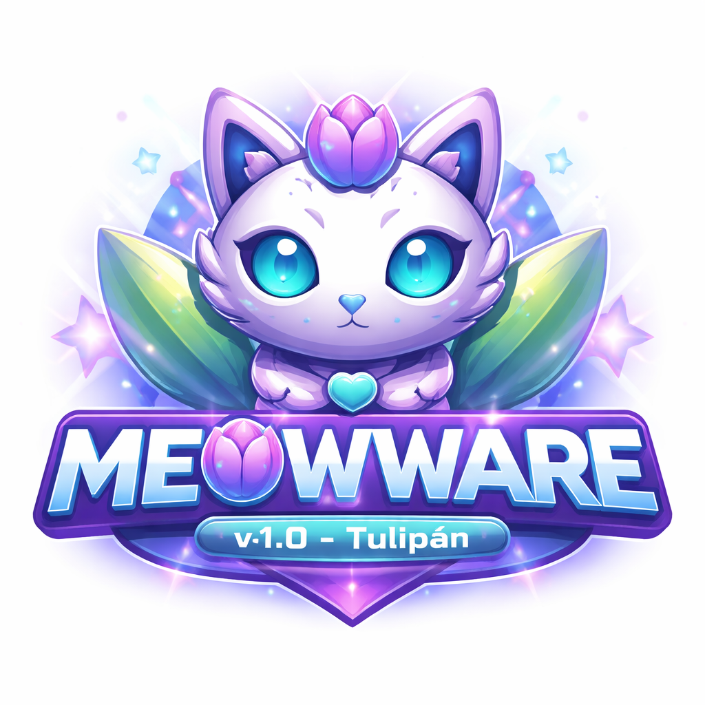

  

  <strong>Plataforma Inteligente de Auditoría de Seguridad y Pentesting Automatizado</strong>

  Auditoría ética • Caja negra • IA aplicada a seguridad • Reportes profesionales

---

## 🚀 ¿Qué es Meowware?

**Meowware** es una plataforma profesional de auditoría de seguridad que combina  
**pentesting automatizado**, **análisis avanzado de infraestructura** e **inteligencia artificial** para detectar, correlacionar y priorizar vulnerabilidades de forma precisa y eficiente.

Está diseñada para **auditorías éticas de caja negra**, sin necesidad de instalar agentes ni software en los sistemas objetivo.

Ideal para:
- Pentesters
- Consultoras de seguridad
- Equipos Red Team / Blue Team
- Auditorías internas y externas

---

## ✨ Capacidades Clave

### 🧠 Inteligencia Artificial Aplicada a Seguridad
- **Motor Cognitivo** basado en DeepSeek API
- **Análisis Contextual** según tecnologías detectadas
- **Sistema de Hipótesis** de ataque automático
- **Detección de Anomalías** y comportamientos inusuales
- **Aprendizaje Continuo** a partir de auditorías previas
- **Fallback inteligente** cuando la IA no está disponible

---

### 🔍 Reconocimiento y Enumeración Avanzada
- Descubrimiento de subdominios (amass, crt.sh, múltiples fuentes)
- Escaneo agresivo de puertos y servicios con Nmap
- Detección de:
  - Sistemas operativos
  - CMS y frameworks
  - Bases de datos
  - Tecnologías web
- Análisis DNS:
  - Transferencias de zona
  - DNSSEC
  - Resolvers abiertos

---

### 🛡️ Auditoría de Seguridad Integral
- **Vulnerabilidades Web**
  - SQL Injection
  - XSS
  - LFI / RFI
  - SSRF
  - Path Traversal
- **SSL/TLS**
  - Protocolos inseguros
  - Configuraciones débiles
- **CMS**
  - WordPress
  - Joomla
  - Drupal
- **APIs**
  - REST
  - GraphQL
  - SOAP
- **Headers de Seguridad**
  - CSP
  - CORS
  - HSTS
  - X-Frame-Options

---

### 📊 Reportes Profesionales
- **Reporte Ejecutivo**
  - Impacto de negocio
  - Riesgos clave
  - Lenguaje no técnico
- **Dashboard Interactivo**
  - Métricas
  - Severidad
  - Superficie de ataque
- **Reporte Técnico**
  - Evidencia
  - CVEs
  - Recomendaciones accionables
- **Deduplicación Inteligente**
  - Hallazgos consolidados
  - Menos ruido, más claridad

---

### 🎯 Funcionalidades Avanzadas
- Perfiles de auditoría por tecnología
- Paralelización inteligente de múltiples hosts
- Clasificación automática de hallazgos:
  - `POTENTIAL`
  - `LIKELY`
  - `CONFIRMED`
- Técnicas automáticas de evasión de WAF (Cloudflare y similares)
- Throttling dinámico para evitar bloqueos

---
